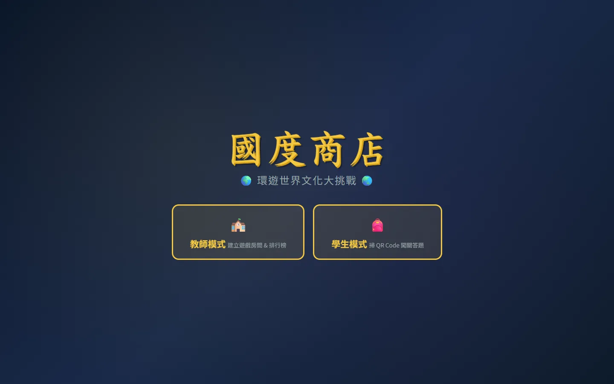

# 國度商店｜環遊世界文化大挑戰

線上網站：https://shuan14408-ops.github.io/internationalstore/

以世界各地的商店與零食為主題的分組闖關遊戲。學生掃描 QR Code 進入亞洲、歐洲、非洲、美洲、大洋洲五大洲的關卡，回答文化題目，比賽哪一組最先環遊世界。

## 設計理念

- **從生活切入國際教育**：用學生熟悉的零食、市場與商店當題材，例如日本的金平糖、泰國水上市場的船麵，讓文化學習更貼近生活。
- **每一題都是一個小故事**：答題後會出現解說，例如金平糖如何從葡萄牙傳到日本、為什麼駄菓子屋的貨架特別矮，學生答錯也能學到東西。
- **分組合作**：學生以隊伍為單位討論作答，練習溝通與合作。
- **老師掌握課堂節奏**：教師模式可以建立遊戲房間、列印各大洲的 QR Code、手動確認各組過關，並用即時排行榜帶動全班氣氛。

## 玩法

1. 老師進入教師模式，建立房間並列印五大洲的 QR Code，張貼在教室各處。
2. 學生分組，選擇隊伍後掃描 QR Code 進入關卡作答。
3. 完成一洲的題目後舉手，由老師在控制台確認過關。
4. 排行榜即時更新，最先完成五大洲的隊伍獲勝。

## 技術

- HTML / CSS / JavaScript（單一檔案）
- QR Code 產生：qrcode.js
- 部署於 GitHub Pages
